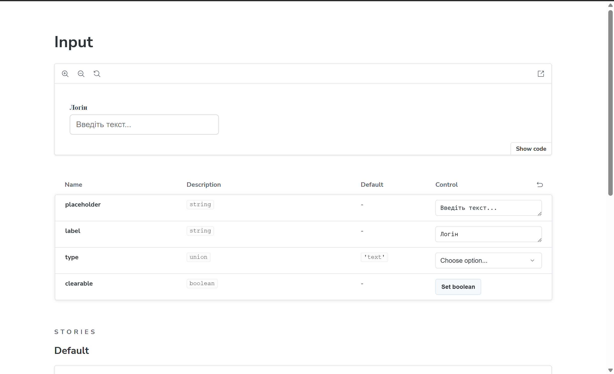
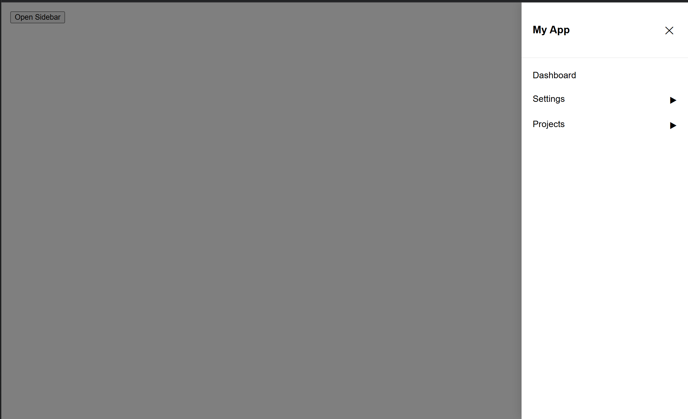
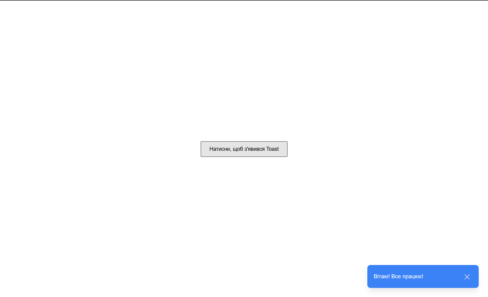

# 🚀 DT UI Component Library

Сучасна бібліотека UI-компонентів, розроблена як тестове завдання для **DevelopsToday**. Побудована на базі **React**, **TypeScript** та **Storybook** з акцентом на чистий код та чудовий UX.

## ✨ Реалізовані компоненти

### 1. ⌨️ Smart Input

Гнучкий компонент введення з розширеним функціоналом:

- **Типи:** text, password, number.
- **Функції:** перемикач видимості пароля (eye icon toggle) та кнопка швидкого очищення (`clearable`).
- **Storybook:** інтегровано **Addon-Controls** для live-редагування властивостей.

### 2. 🗺️ Sidebar Menu

Багаторівнева навігація для складних інтерфейсів:

- **Вкладеність:** повна підтримка багаторівневих підменю (Nested submenus).
- **Анімація:** плавний slide-in ефект з правого боку.
- **UX:** закриття при кліку на Overlay (фон).

### 3. 🔔 Toast Notification

Система миттєвих сповіщень:

- **Типи:** Success, Error, Info.
- **Поведінка:** автоматичне зникнення через заданий інтервал та анімована поява.

## 📸 Візуальний огляд (Storybook)

|         **Smart Input**          |             **Sidebar Menu**              |           **Toast UI**           |
| :------------------------------: | :---------------------------------------: | :------------------------------: |
|  |  |  |

## 🛠 Технологічний стек

- **React 18** + **Vite**
- **TypeScript** (сувора типізація)
- **Storybook 8** (документація компонентів)
- **CSS Modules** (ізоляція стилів)

## 🚀 Як запустити проєкт

1. **Встановіть залежності:**
   ```bash
   npm install
   ```
